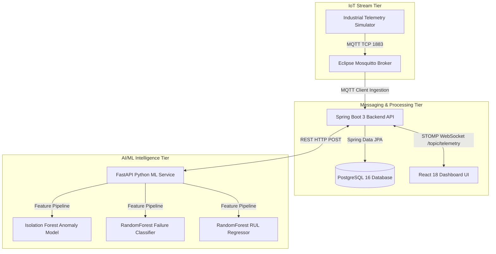
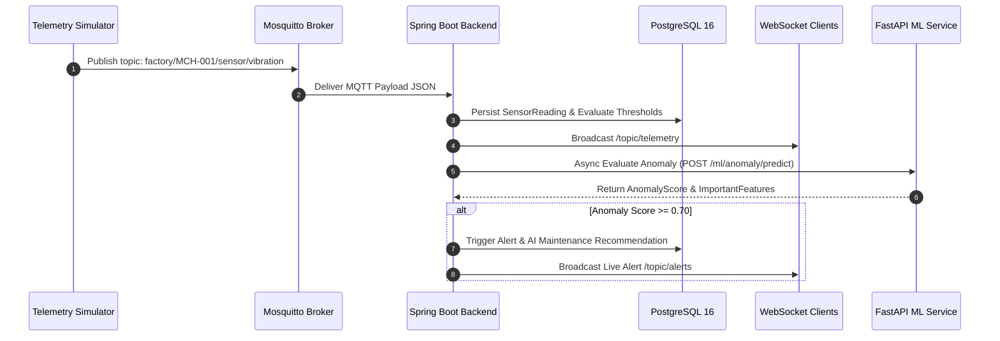

# Architecture Diagrams & Flow Specifications

## System Architecture Diagram

```mermaid
graph TD
    subgraph IoT Stream Tier
        SIM[Industrial Telemetry Simulator] -->|MQTT TCP 1883| MOS[Eclipse Mosquitto Broker]
    end

    subgraph Messaging & Processing Tier
        MOS -->|MQTT Client Ingestion| SB[Spring Boot 3 Backend API]
        SB -->|Spring Data JPA| DB[(PostgreSQL 16 Database)]
        SB <-->|STOMP WebSocket /topic/telemetry| FE[React 18 Dashboard UI]
    end

    subgraph AI/ML Intelligence Tier
        SB <-->|REST HTTP POST| ML[FastAPI Python ML Service]
        ML -->|Feature Pipeline| ISO[Isolation Forest Anomaly Model]
        ML -->|Feature Pipeline| RF[RandomForest Failure Classifier]
        ML -->|Feature Pipeline| RUL[RandomForest RUL Regressor]
    end
```

## Telemetry Ingestion Sequence Diagram

```mermaid
sequenceDiagram
    autonumber
    participant SIM as Telemetry Simulator
    participant MQTT as Mosquitto Broker
    participant SB as Spring Boot Backend
    participant DB as PostgreSQL 16
    participant WS as WebSocket Clients
    participant ML as FastAPI ML Service

    SIM->>MQTT: Publish topic: factory/MCH-001/sensor/vibration
    MQTT->>SB: Deliver MQTT Payload JSON
    SB->>DB: Persist SensorReading & Evaluate Thresholds
    SB->>WS: Broadcast /topic/telemetry
    SB->>ML: Async Evaluate Anomaly (POST /ml/anomaly/predict)
    ML-->>SB: Return AnomalyScore & ImportantFeatures
    alt Anomaly Score >= 0.70
        SB->>DB: Trigger Alert & AI Maintenance Recommendation
        SB->>WS: Broadcast Live Alert /topic/alerts
    end
```
